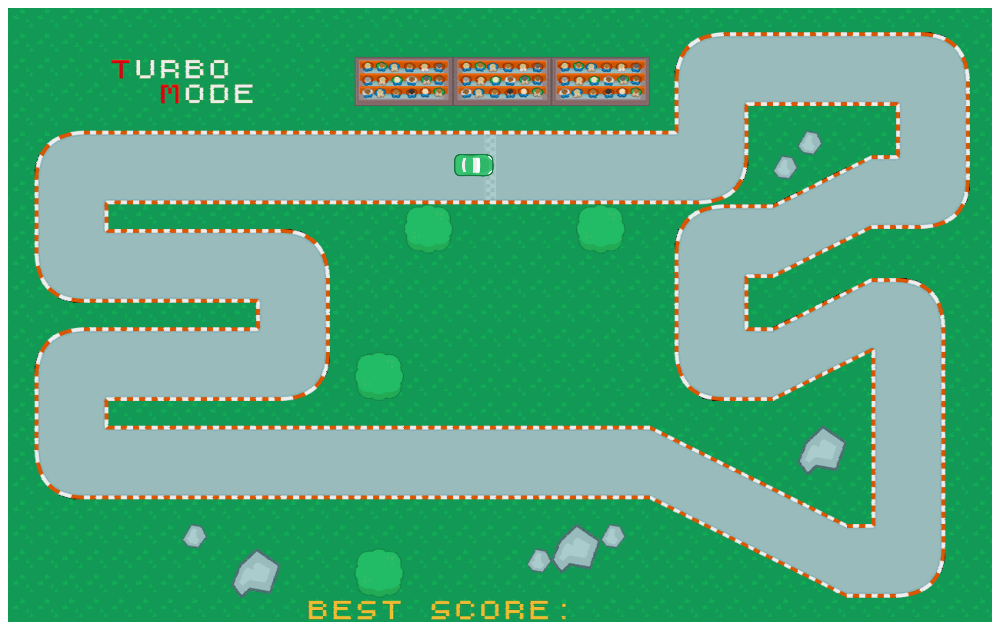
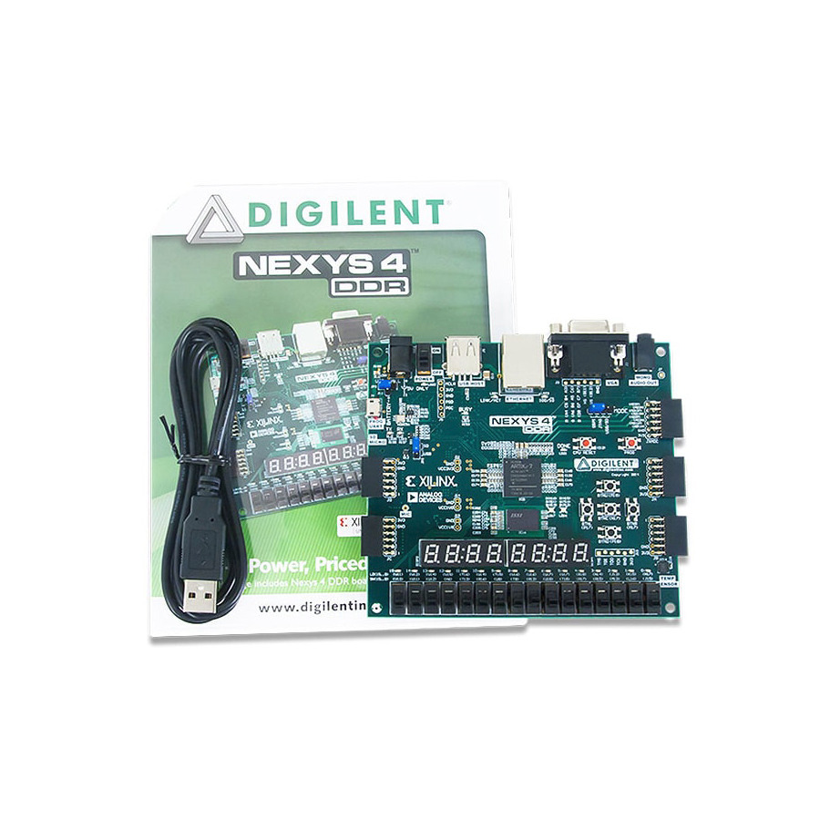

# TURBO MODE – An FPGA Racing Game

### A fully hardware-implemented racing game designed and executed on an FPGA platform.

------------------------------------------------------------------------

## Overview

**TURBO MODE** is a real-time racing game implemented entirely in Verilog and deployed on an FPGA board.

All graphics, movement, scoring, audio, and input handling are implemented directly in synchronous digital logic.

The project runs on the **Nexys A7-100T FPGA** and outputs to a VGA display with keyboard and audio support.

  

------------------------------------------------------------------------

## Features

-   Real-time VGA rendering
-   Tile-based track engine
-   Smooth car rotation around its center
-   Pixel-accurate collision detection
-   Temporary collision blocking with blinking effect
-   Lap-based timing system
-   Best lap tracking
-   7-segment display integration
-   Background music (toggleable)
-   Lap completion sound effect
-   Map extensions using board switches
-   Car color selection

------------------------------------------------------------------------

## System Architecture

TURBO MODE is built using a modular hierarchical design.\
Each subsystem was developed and tested independently before integration.

### Main Modules

-   **VGA Controller**\
    Generates sync signals and pixel coordinates.

-   **Tile Renderer**\
    Maps tile memory to screen pixels.

-   **Car Logic**\
    Handles movement, acceleration, rotation, and blinking state.

-   **Collision Engine**\
    Validates walkable regions using a collision mask.

-   **Lap & Score System**\
    Ensures checkpoint order and calculates lap time.

-   **Keyboard Interface (PS/2)**\
    Decodes scan codes for player control.

-   **Audio Engine (PWM-based)**\
    Plays background music and lap sounds.

-   **Peripheral Controller**\
    Handles switches and 7-segment display output.

------------------------------------------------------------------------

## Controls

| Key / Switch | Function                      |
|--------------|-------------------------------|
| Arrow Keys   | Move car                      |
| Space        | Accelerate                    |
| Switch       | Toggle background music       |
| Switches     | Enable/disable map extensions |
| Switch       | Change car color              |

When a collision occurs: - The car does not reset - Movement is temporarily blocked - The car blinks for visual feedback

------------------------------------------------------------------------

## Map Extensions

The base map can be extended using board switches.

When map extensions are enabled: - The car resets to the start - The lap timer resets - The best score resets

This ensures fair timing when the track layout changes.

------------------------------------------------------------------------

## Scoring Logic

A lap is considered valid only if:

1.  The car crosses the start line\
2.  All checkpoints are visited in order\
3.  The car returns to the start line

Lap time: - Incremented once per second - Displayed on the 7-segment display - Best lap is stored and shown - Lap completion triggers an on-screen message and sound

------------------------------------------------------------------------

## Audio System

Audio is generated using PWM output.

Features: - Background music stored in on-chip memory - Lap completion sound effect

No external DAC is required.

------------------------------------------------------------------------

## Testing & Verification

Testing TURBO MODE required both simulation and hardware validation.

-   VGA timing verified via waveform simulation
-   Tile output validated through pixel capture
-   Collision masks tested using generated maps
-   Movement and scoring verified using signal monitoring
-   Hardware testing performed on Nexys A7 board

Due to encrypted IP limitations in simulation, custom validation strategies were used.

------------------------------------------------------------------------

## Tools & Technologies

-   SystemVerilog
-   Xilinx Vivado
-   Nexys A7-100T FPGA
-   Python
-   VGA interface
-   PS/2 keyboard interface
-   PWM audio output

------------------------------------------------------------------------

## How to Run

1.  Open the project in Vivado\
2.  Synthesize and implement\
3.  Generate bitstream\
4.  Program the Nexys A7-100T board\
5.  Connect:
    -   VGA monitor\
    -   PS/2 keyboard\
    -   Speaker\
6.  Enjoy TURBO MODE

------------------------------------------------------------------------

## Future Improvements

Future versions could include:

-   Speed bar indicator
-   Ghost car showing best lap
-   Multiplayer mode
-   Boost tiles
-   Acceleration flame effects
-   Animated spectators